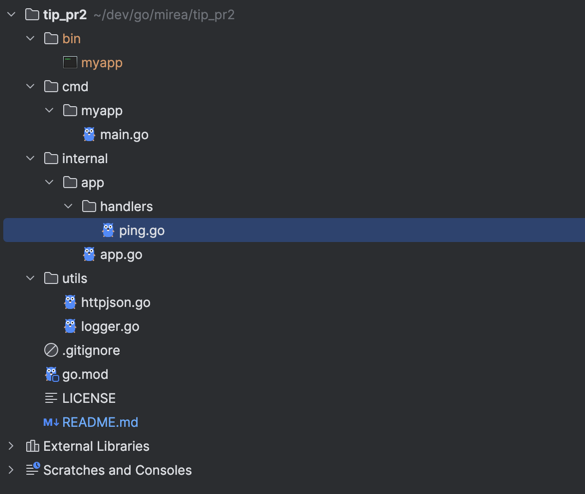
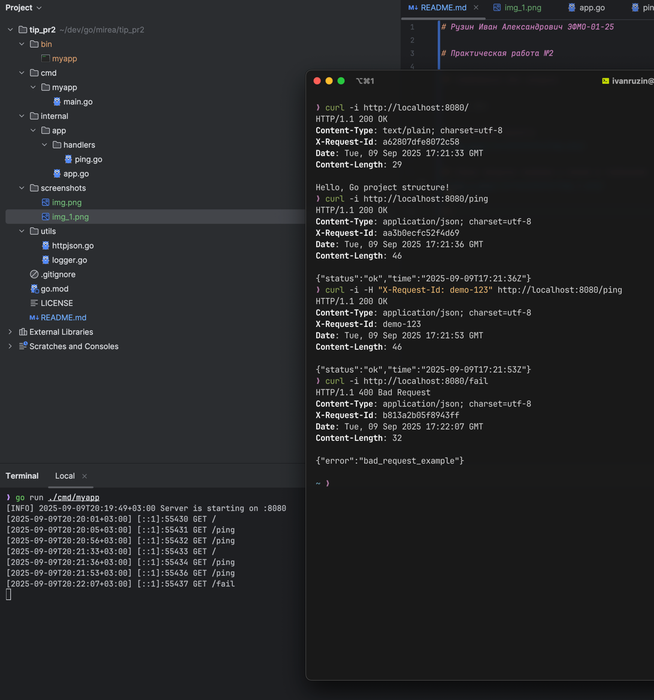

# Рузин Иван Александрович ЭФМО-01-25

# Практическая работа №2

## Инструкция для запуска

```bash
# Установка зависимостей
go mod tidy

# Запуск сервера на 8080
go run ./cmd/myapp

```

## Структура проекта



## Скрин запуска сервера и логов в терминале



## Мини-эссе

- **api/**: контракты проекта — спецификации API, swagger-файлы, protobuf и другие.

- **configs/**: примеры конфигураций, полезные для разработчиков и CI/CD, которые не должны смешиваться с исходным
  кодом.

- **scripts/**: сценарии, утилиты и автоматизация — например, сборка, обновление зависимостей, генерация кода.

- **build/**: артефакты сборки, Dockerfile, CI/CD-конфигурации.

- **deployments/**: манифесты для Kubernetes, Terraform, docker-compose и прочее.

- **docs/**: документация, архитектурные схемы, гайды — не мешают коду, доступны для чтения.

- **test/**: тестовые данные, мок-серверы, утилиты для тестирования, которые не входят в пакеты приложения.
